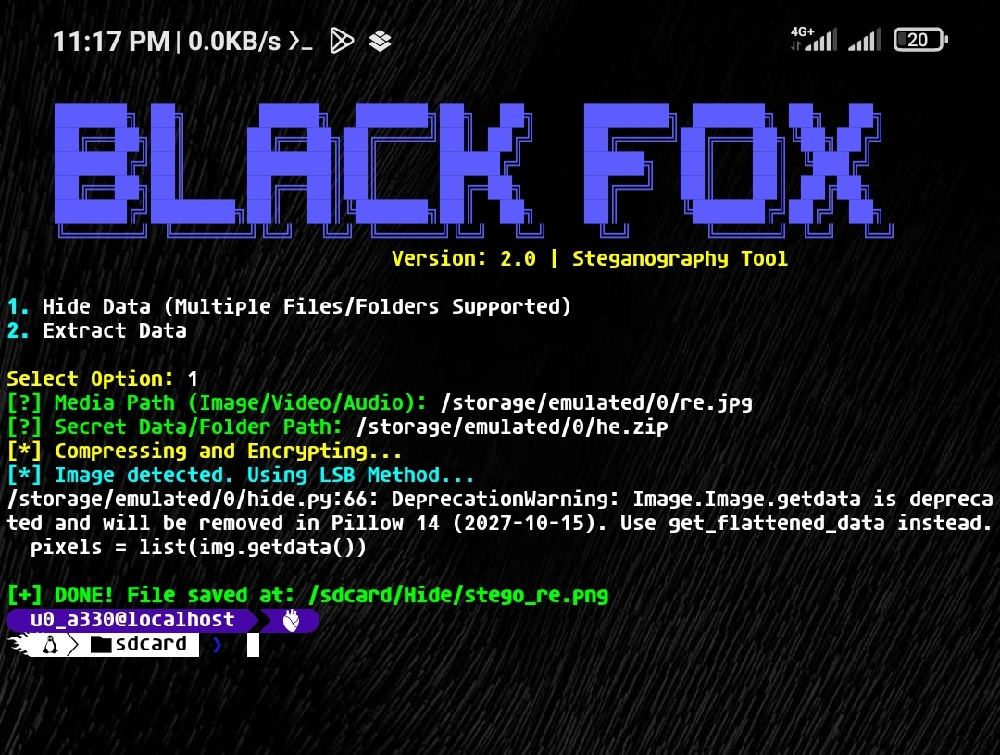

# 🦊 BLACK FOX - Advanced Media Steganography Tool


**BLACK FOX** is a powerful and easy-to-use Python-based steganography tool that allows you to hide files or entire directories inside images, videos, or audio files. It uses both **LSB (Least Significant Bit)** for images and **EOF (End of File)** for audio/video to ensure data integrity.

---

## 📸 Tool Preview


---

## ✨ Features
- 🖼️ **LSB Steganography:** Hides data inside image pixels without changing the visual quality.
- 📂 **Multi-File Support:** Automatically zips files or folders before hiding them.
- 🎥 **Video/Audio Support:** Uses EOF method to append data securely in media files.
- 📱 **Mobile Friendly:** Fully compatible with Termux on Android.

---

## 🚀 Installation

### 1. Clone the repository:
```bash
git clone https://github.com/akash-black-fox/Media-Steganography.git
cd Media-Steganography

```
### 2. Install dependencies:
```bash
pip install Pillow

```
*Note: If you are using Termux, run pkg install python python-pip libjpeg-turbo before installing Pillow.*
## 🛠️ How to Use
 1. **Run the script:**
   ```bash
   python black_fox.py
   
   ```
 2. **Hide Data:** - Select option 1.
   * Provide the path of the media file (e.g., image.jpg).
   * Provide the path of the file/folder you want to hide.
   * Find your hidden file in /sdcard/Hide/ (or the ./Hide/ folder).
 3. **Extract Data:**
   * Select option 2.
   * Provide the path of the stego file.
   * The hidden data will be extracted as extracted_data.zip.
## ⚠️ Disclaimer
This tool is developed for **educational purposes only**. The developer is not responsible for any misuse of this tool. Steganography should be used ethically and legally.
## 📜 License
This project is licensed under the MIT License - see the LICENSE file for details.
**Made with ❤️ by [AKASH HASAN]**
```
